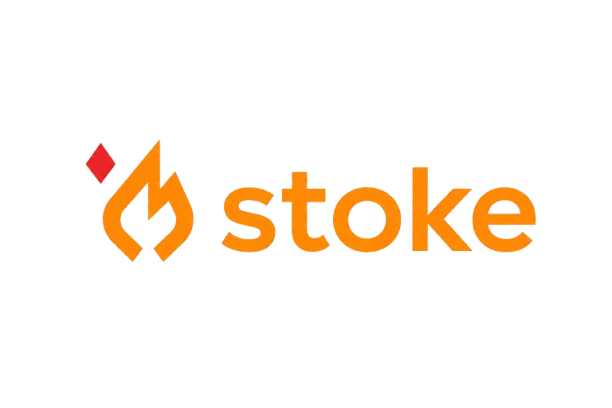

<p align="center">
  
</p>

<h2 align="center">Build, run, and scaffold projects in multiple languages.</h2>

Supports Python, Java, C, and C++. Includes project scaffolding for Spring Boot, FastAPI, Flask, and Django.

## Installation

### Windows (recommended for beginners)
Download the installer from [Releases](https://github.com/dvdsvds/stoke/releases/latest). Python is bundled — no prerequisites.

### pip (for developers)
```bash
pip install stoke-build
```
Requires Python 3.11 or higher.

## Quick Start

```bash
mkdir myapp
cd myapp
stoke init
stoke build
stoke run
```

## Features
- **Multi-language** — Python, Java, C, C++ with a single stoke.toml
- **Language installation** — install Python/JDK/gcc via `stoke install`
- **Project scaffolding** — `stoke init spring-boot`, `stoke init fastapi`, `stoke init flask`, `stoke init django`
- **Python environments** — venv or conda
- **Watch mode and hot-reload** for all languages
- **Reproducible builds** via lock files
- **Auto IDE integration** (VSCode, IntelliJ, Eclipse)

## Documentation

Full documentation: [https://dvdsvds.github.io/stoke/](https://dvdsvds.github.io/stoke/)

Also available in the repo:
- [English README](./docs/README_en.md)
- [한국어 README](./docs/README_ko.md)

## Licenas

MIT